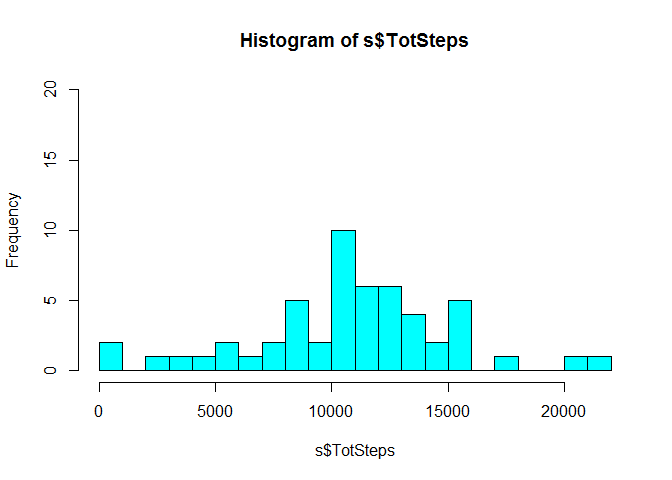
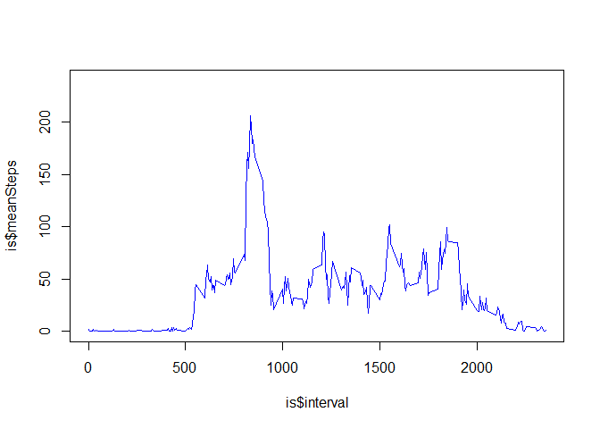
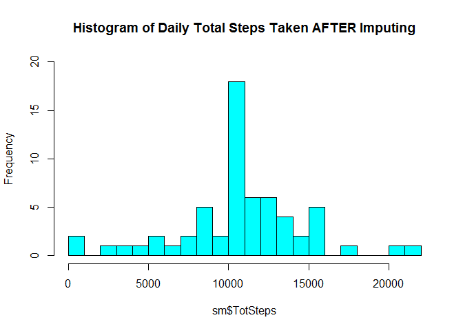
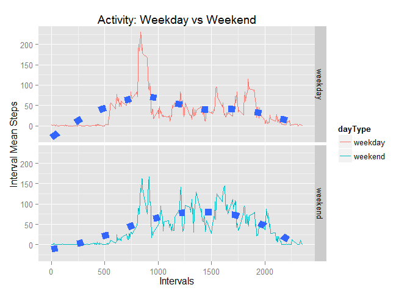

# Reproducible Research: Peer Assessment1
Bill Killacky  
January 18, 2014  


Report creation time: Fri Jan 16 2015 10:45:58 PM.


```r
    setwd("C:/Users/Bill Killacky/Documents/Coursera/ReproducableResearch/RepData_PeerAssessment1/RepData_PeerAssessment1")
    w <- getwd()
    f <- 'activity.csv'

    # unzip the file to the current directory.
    f2 <- paste(w, '/activity.zip', sep='')
    unzip(f2)

    library(plyr)
    library(xtable)
    library(ggplot2)
    
    # warn if input file is not in working directory    
    if (!file.exists(f)) {
        print(paste('input file',f,'is not in working directory:',w))
    }
```

  
##Loading and preprocessing the data
* Grading: Does the submission show code for reading in the dataset and/or processing the data? 


```r
    # 1.    Load the data 
    a <- read.csv(file=f, stringsAsFactors=FALSE)
    
    # 2.    Process/transform the data into a steps per day analysis format
    s <- ddply(a, .(date), summarize,
                 TotSteps=sum(steps), 
                 meanSteps=mean(steps), 
                 medianSteps=median(steps)
               )
```


* Grading: Does the submission contain a histogram of the total number of steps taken each day?  


```r
    # 1.    Make a histogram of the total number of steps taken each day
    hist(s$TotSteps, breaks=26, col='cyan', ylim=c(0,20))
```

 

##What is mean total number of steps taken per day?
* Grading: Are both the mean and median number of steps taken each day reported?  


```r
    # Calculate and report the mean and median total number of steps taken per day
    meanSteps <- mean(s$TotSteps, na.rm=TRUE)
    medianSteps <- median(s$TotSteps, na.rm=TRUE)

    vals <- data.frame(meanSteps, medianSteps)
    colnames(vals) <- c('mean steps per day', 'median steps per day')

    xt <- xtable(vals)
    print(xt, type="html")  
```

<!-- html table generated in R 3.1.2 by xtable 1.7-4 package -->
<!-- Fri Jan 16 22:45:59 2015 -->
<table border=1>
<tr> <th>  </th> <th> mean steps per day </th> <th> median steps per day </th>  </tr>
  <tr> <td align="right"> 1 </td> <td align="right"> 10766.19 </td> <td align="right"> 10765 </td> </tr>
   </table>

```r
    #xt <- xtable(s)
    #print(xt, type="html")  
```


##What is the average daily activity pattern?
* Grading: Is there a time series plot of the average number of steps taken (averaged across all days) versus the 5 minute intervals?


```r
    is <- aggregate(a$steps, by=list(interval=a$interval), mean, na.rm=TRUE)
    colnames(is) <- c('interval', 'meanSteps')
    plot(is$interval, is$meanSteps, type='l', col='blue', ylim=c(0, 240))
```

 
  

###Most Active 5-minute interval  
* Grading: Does the report give the 5-minute interval that, on average, contains the maximum number of steps?   


```r
    xt <- is[is$meanSteps==max(is$meanSteps),]
    xt <- xtable(xt)
    print(xt, type="html") 
```

<!-- html table generated in R 3.1.2 by xtable 1.7-4 package -->
<!-- Fri Jan 16 22:45:59 2015 -->
<table border=1>
<tr> <th>  </th> <th> interval </th> <th> meanSteps </th>  </tr>
  <tr> <td align="right"> 104 </td> <td align="right"> 835 </td> <td align="right"> 206.17 </td> </tr>
   </table>


##Imputing Missing Values
1.    Calculate and report the total number of missing values in the dataset (i.e. the total number of rows with NAs)  


```r
    nf <- nrow(a)                     # number of rows in original dataset
    nna <- nrow(a[is.na(a$steps),])   # number of rows with steps = NA
    nnaPct <- nna/nf                  # percent of original dataset with NA
    nok <- nf - nna                   # number of rows that do not have NA steps
    
    fn <- sprintf('%d', nf)
    fnna <- sprintf('%d',nna)
    fnnaPct <- paste(sprintf('%d', floor(nnaPct*100)), '%')
    fok <- sprintf('%d', nok)
    
    Description <- c('number of rows with steps = NA', 'number of rows in original dataset', 
                'number of rows that do not have NA steps', 'percent of original dataset with NA')
    Rows <- c(fnna, fn, fok, fnnaPct)
```

Missing Value Statistics  

```r
    xt <- data.frame(Description, Rows)
    xt <- xtable(xt)
    print(xt, type="html")   
```

<!-- html table generated in R 3.1.2 by xtable 1.7-4 package -->
<!-- Fri Jan 16 22:45:59 2015 -->
<table border=1>
<tr> <th>  </th> <th> Description </th> <th> Rows </th>  </tr>
  <tr> <td align="right"> 1 </td> <td> number of rows with steps = NA </td> <td> 2304 </td> </tr>
  <tr> <td align="right"> 2 </td> <td> number of rows in original dataset </td> <td> 17568 </td> </tr>
  <tr> <td align="right"> 3 </td> <td> number of rows that do not have NA steps </td> <td> 15264 </td> </tr>
  <tr> <td align="right"> 4 </td> <td> percent of original dataset with NA </td> <td> 13 % </td> </tr>
   </table>


###Impute Plan: Replace NA with the mean steps for that 5-minute interval
2.  Strategy for filling in all of the missing values in the dataset:  **Use the mean for that 5-minute interval**.
3.  Create a new dataset (m) that is equal to the original dataset (a) but with the missing data filled in.  

* Grading: Does the report describe and show with code a strategy for imputing missing data?  


```r
    # Create new dataset m that is equal to the original dataset but with the missing data filled
    # in with the mean steps matching on the 5-minute interval
    #
    m <- merge(is, a, by.x='interval', by.y='interval')
    n <- nrow(m)
    for (i in 1:n) {
        if (is.na(m$steps[i])) {
            m$steps[i] <- m$meanSteps[i]     # replace missing steps data with the interval mean
        }
    }

#head(a[a$date=='2012-10-01',])    # data snapshot Before Impute Plan
#head(m[m$date=='2012-10-01', ])   # new data snapshot After Impute Plan (Note steps NA replaced with interval mean value)
```

* Grading: Does the report contain a histogram of the total number of steps taken each day after missing values were imputed?


```r
    # 2.    Process/transform the new dataset without NAs into a steps per day analysis format
    sm <- ddply(m, .(date), summarize,
                 TotSteps=sum(steps), 
                 meanSteps=mean(steps), 
                 medianSteps=median(steps)
               )

    # 1.    Make a histogram of the total number of steps taken each day
    hist(sm$TotSteps, breaks=26, col='cyan', ylim=c(0,20), main='Histogram of Daily Total Steps Taken AFTER Imputing')
```

 

```r
#s[is.na(s$TotSteps),]  # Show Dates formerly without data
#sm[is.na(s$TotSteps),] # Show Dates with Imputed Data
```

####4. Impact of imputing missing data
4a.  * Make a histogram of the total number of steps taken each day and  
**Answer: Please refer to histogram above with title containing "AFTER Imputing"**  

4b.  * Calculate and report the mean and median total number of steps taken per day.  

```r
    # Report the mean and median total number of steps taken per day
    meanSteps <- mean(sm$TotSteps, na.rm=TRUE)
    medianSteps <- median(sm$TotSteps, na.rm=TRUE)

    vals <- data.frame(meanSteps, medianSteps)
    colnames(vals) <- c('mean steps per day', 'median steps per day')

    xt <- xtable(vals)
    print(xt, type="html") 
```

<!-- html table generated in R 3.1.2 by xtable 1.7-4 package -->
<!-- Fri Jan 16 22:46:00 2015 -->
<table border=1>
<tr> <th>  </th> <th> mean steps per day </th> <th> median steps per day </th>  </tr>
  <tr> <td align="right"> 1 </td> <td align="right"> 10766.19 </td> <td align="right"> 10766.19 </td> </tr>
   </table>

```r
    #xt <- xtable(sm)
    #print(xt, type="html")  
```

4c.  * Do these values differ from the estimates from the first part of the assignment?   
**Answer:**  
* **The mean steps per day remain the same pre and post imputation.**  
* **The median steps per day changed only slightly from 10765 to 10766.19**  

4d.  * What is the impact of imputing missing data on the estimates of the total daily number of steps?    
**Answer: The addition of eight days of 10766.19 total steps added 8 to the frequency in the center of the histogram; and caused the median to be 10766.19 as well.**   

 

  
####Updated Missing Value Statistics after imputation  


```r
    # Recalculate steps by interval using new dataset with replaced means for the old NAs.
    #
    is2 <- aggregate(m$steps, by=list(interval=m$interval), mean, na.rm=TRUE)
    colnames(is2) <- c('interval', 'meanSteps')
    #plot(is2$interval, is2$meanSteps, type='l', col='green', ylim=c(0, 240))
```


```r
    #
    # After Imputing Missing Values, verify that NAs are gone and total rows matches original dataset.
    #
    nf <- nrow(m)                     # number of rows in original dataset
    nna <- nrow(m[is.na(m$steps),])   # number of rows with steps = NA
    nnaPct <- nna/nf                  # percent of original dataset with NA
    nok <- nf - nna                   # number of rows that do not have NA steps
    
    fn <- sprintf('%d', nf)
    fnna <- sprintf('%d',nna)
    fnnaPct <- paste(sprintf('%d', floor(nnaPct*100)), '%')
    fok <- sprintf('%d', nok)
    
    Description <- c('number of rows with steps = NA', 'number of rows in original dataset', 
                'number of rows that do not have NA steps', 'percent of original dataset with NA')
    Rows <- c(fnna, fn, fok, fnnaPct)

    xt <- data.frame(Description, Rows)
    xt <- xtable(xt)
    print(xt, type="html")   
```

<!-- html table generated in R 3.1.2 by xtable 1.7-4 package -->
<!-- Fri Jan 16 22:46:00 2015 -->
<table border=1>
<tr> <th>  </th> <th> Description </th> <th> Rows </th>  </tr>
  <tr> <td align="right"> 1 </td> <td> number of rows with steps = NA </td> <td> 0 </td> </tr>
  <tr> <td align="right"> 2 </td> <td> number of rows in original dataset </td> <td> 17568 </td> </tr>
  <tr> <td align="right"> 3 </td> <td> number of rows that do not have NA steps </td> <td> 17568 </td> </tr>
  <tr> <td align="right"> 4 </td> <td> percent of original dataset with NA </td> <td> 0 % </td> </tr>
   </table>


##Are There Differences in Activity Patterns between Weekdays and Weekends?


```r
    #
    # Determine if a date is weekend or a weekday
    #
    m$date2 <- as.POSIXlt(m$date)
    m$wday <- m$date2$wday
    m$weekdays <- weekdays(m$date2)
    m$dayType <- ifelse(m$wday %in% c(0,6), 'weekend', 'weekday')   #0=Sun, 1=M, 2=Tu, 3=W, 4=Th, 5=F, 6=Sat
    #head(m, 7)
    # What are the counts of the different types of day (weekend, weekday)
    table(m$dayType)
```

```
## 
## weekday weekend 
##   12960    4608
```


```r
    mm <- ddply(m, .(interval, dayType), summarize, 
                intSumSteps=sum(steps), 
                intMeanSteps=mean(steps))
    #head(mm,6)
    g <- ggplot(mm, aes(interval, intMeanSteps))
    g <- g + geom_line(aes(color=dayType))
    g <- g + geom_smooth(size=4, linetype=3, method='loess', se=FALSE)
    g <- g + facet_grid(dayType~.)   # multiple panels result from facet
    g <- g + labs(title = 'Activity: Weekday vs Weekend') + labs(x='Intervals', y='Interval Mean Steps')
    g
```

 

* Grading: Does the report contain a panel plot comparing the average number of steps taken per 5-minute interval across weekdays and weekends?

###Weekends and Weekday Patterns are Different
* Note: the square blue boxes are smoothing of the interval activity through out the day.
* Overall weekends tend to be more active than weekdays (based on the number of blue boxes above 50)
* Weekends start later and end later with more activity in the middle of the day.
* Weekdays start sooner with a spike of activity and are relatively inactive until the less active evening commute home.
* Weekdays also cease activity earlier perhaps indicating an earlier bed time during the work week.

* Grading: Does the report show all of the R code needed to reproduce the results (numbers, plots, etc.) in the report?

