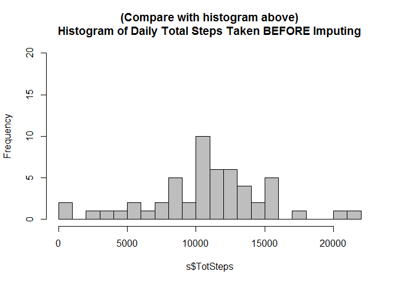

# Reproducible Research: Peer Assessment1
Bill Killacky  
January 18, 2014  


Report creation time: Fri Jan 16 2015 4:40:19 PM.


```r
    setwd("C:/Users/Bill Killacky/Documents/Coursera/ReproducableResearch/RepData_PeerAssessment1/RepData_PeerAssessment1")
    w <- getwd()
    f <- 'activity.csv'
    f2 <- paste(w, '/activity.zip',sep='')
    unzip(f2)

    library(plyr)
    library(xtable)
    library(ggplot2)
    
    # warn if input file is not in working directory    
    if (!file.exists(f)) {
        print(paste('input file',f,'is not in working directory:',w))
    }
```

  
##Loading and preprocessing the data
* Grading: Does the submission show code for reading in the dataset and/or processing the data? 


```r
    # 1.    Load the data 
    a <- read.csv(file=f, stringsAsFactors=FALSE)
    
    # 2.    Process/transform the data into a steps per day analysis format
    s <- ddply(a, .(date), summarize,
                 TotSteps=sum(steps), 
                 meanSteps=mean(steps), 
                 medianSteps=median(steps)
               )
```

##What is mean total number of steps taken per day?
* Grading: Are both the mean and median number of steps taken each day reported?  


```r
    # Calculate and report the mean and median total number of steps taken per day
    xt <- xtable(s)
    print(xt, type="html")  
```

<!-- html table generated in R 3.1.2 by xtable 1.7-4 package -->
<!-- Fri Jan 16 16:40:20 2015 -->
<table border=1>
<tr> <th>  </th> <th> date </th> <th> TotSteps </th> <th> meanSteps </th> <th> medianSteps </th>  </tr>
  <tr> <td align="right"> 1 </td> <td> 2012-10-01 </td> <td align="right">  </td> <td align="right">  </td> <td align="right">  </td> </tr>
  <tr> <td align="right"> 2 </td> <td> 2012-10-02 </td> <td align="right"> 126 </td> <td align="right"> 0.44 </td> <td align="right"> 0.00 </td> </tr>
  <tr> <td align="right"> 3 </td> <td> 2012-10-03 </td> <td align="right"> 11352 </td> <td align="right"> 39.42 </td> <td align="right"> 0.00 </td> </tr>
  <tr> <td align="right"> 4 </td> <td> 2012-10-04 </td> <td align="right"> 12116 </td> <td align="right"> 42.07 </td> <td align="right"> 0.00 </td> </tr>
  <tr> <td align="right"> 5 </td> <td> 2012-10-05 </td> <td align="right"> 13294 </td> <td align="right"> 46.16 </td> <td align="right"> 0.00 </td> </tr>
  <tr> <td align="right"> 6 </td> <td> 2012-10-06 </td> <td align="right"> 15420 </td> <td align="right"> 53.54 </td> <td align="right"> 0.00 </td> </tr>
  <tr> <td align="right"> 7 </td> <td> 2012-10-07 </td> <td align="right"> 11015 </td> <td align="right"> 38.25 </td> <td align="right"> 0.00 </td> </tr>
  <tr> <td align="right"> 8 </td> <td> 2012-10-08 </td> <td align="right">  </td> <td align="right">  </td> <td align="right">  </td> </tr>
  <tr> <td align="right"> 9 </td> <td> 2012-10-09 </td> <td align="right"> 12811 </td> <td align="right"> 44.48 </td> <td align="right"> 0.00 </td> </tr>
  <tr> <td align="right"> 10 </td> <td> 2012-10-10 </td> <td align="right"> 9900 </td> <td align="right"> 34.38 </td> <td align="right"> 0.00 </td> </tr>
  <tr> <td align="right"> 11 </td> <td> 2012-10-11 </td> <td align="right"> 10304 </td> <td align="right"> 35.78 </td> <td align="right"> 0.00 </td> </tr>
  <tr> <td align="right"> 12 </td> <td> 2012-10-12 </td> <td align="right"> 17382 </td> <td align="right"> 60.35 </td> <td align="right"> 0.00 </td> </tr>
  <tr> <td align="right"> 13 </td> <td> 2012-10-13 </td> <td align="right"> 12426 </td> <td align="right"> 43.15 </td> <td align="right"> 0.00 </td> </tr>
  <tr> <td align="right"> 14 </td> <td> 2012-10-14 </td> <td align="right"> 15098 </td> <td align="right"> 52.42 </td> <td align="right"> 0.00 </td> </tr>
  <tr> <td align="right"> 15 </td> <td> 2012-10-15 </td> <td align="right"> 10139 </td> <td align="right"> 35.20 </td> <td align="right"> 0.00 </td> </tr>
  <tr> <td align="right"> 16 </td> <td> 2012-10-16 </td> <td align="right"> 15084 </td> <td align="right"> 52.38 </td> <td align="right"> 0.00 </td> </tr>
  <tr> <td align="right"> 17 </td> <td> 2012-10-17 </td> <td align="right"> 13452 </td> <td align="right"> 46.71 </td> <td align="right"> 0.00 </td> </tr>
  <tr> <td align="right"> 18 </td> <td> 2012-10-18 </td> <td align="right"> 10056 </td> <td align="right"> 34.92 </td> <td align="right"> 0.00 </td> </tr>
  <tr> <td align="right"> 19 </td> <td> 2012-10-19 </td> <td align="right"> 11829 </td> <td align="right"> 41.07 </td> <td align="right"> 0.00 </td> </tr>
  <tr> <td align="right"> 20 </td> <td> 2012-10-20 </td> <td align="right"> 10395 </td> <td align="right"> 36.09 </td> <td align="right"> 0.00 </td> </tr>
  <tr> <td align="right"> 21 </td> <td> 2012-10-21 </td> <td align="right"> 8821 </td> <td align="right"> 30.63 </td> <td align="right"> 0.00 </td> </tr>
  <tr> <td align="right"> 22 </td> <td> 2012-10-22 </td> <td align="right"> 13460 </td> <td align="right"> 46.74 </td> <td align="right"> 0.00 </td> </tr>
  <tr> <td align="right"> 23 </td> <td> 2012-10-23 </td> <td align="right"> 8918 </td> <td align="right"> 30.97 </td> <td align="right"> 0.00 </td> </tr>
  <tr> <td align="right"> 24 </td> <td> 2012-10-24 </td> <td align="right"> 8355 </td> <td align="right"> 29.01 </td> <td align="right"> 0.00 </td> </tr>
  <tr> <td align="right"> 25 </td> <td> 2012-10-25 </td> <td align="right"> 2492 </td> <td align="right"> 8.65 </td> <td align="right"> 0.00 </td> </tr>
  <tr> <td align="right"> 26 </td> <td> 2012-10-26 </td> <td align="right"> 6778 </td> <td align="right"> 23.53 </td> <td align="right"> 0.00 </td> </tr>
  <tr> <td align="right"> 27 </td> <td> 2012-10-27 </td> <td align="right"> 10119 </td> <td align="right"> 35.14 </td> <td align="right"> 0.00 </td> </tr>
  <tr> <td align="right"> 28 </td> <td> 2012-10-28 </td> <td align="right"> 11458 </td> <td align="right"> 39.78 </td> <td align="right"> 0.00 </td> </tr>
  <tr> <td align="right"> 29 </td> <td> 2012-10-29 </td> <td align="right"> 5018 </td> <td align="right"> 17.42 </td> <td align="right"> 0.00 </td> </tr>
  <tr> <td align="right"> 30 </td> <td> 2012-10-30 </td> <td align="right"> 9819 </td> <td align="right"> 34.09 </td> <td align="right"> 0.00 </td> </tr>
  <tr> <td align="right"> 31 </td> <td> 2012-10-31 </td> <td align="right"> 15414 </td> <td align="right"> 53.52 </td> <td align="right"> 0.00 </td> </tr>
  <tr> <td align="right"> 32 </td> <td> 2012-11-01 </td> <td align="right">  </td> <td align="right">  </td> <td align="right">  </td> </tr>
  <tr> <td align="right"> 33 </td> <td> 2012-11-02 </td> <td align="right"> 10600 </td> <td align="right"> 36.81 </td> <td align="right"> 0.00 </td> </tr>
  <tr> <td align="right"> 34 </td> <td> 2012-11-03 </td> <td align="right"> 10571 </td> <td align="right"> 36.70 </td> <td align="right"> 0.00 </td> </tr>
  <tr> <td align="right"> 35 </td> <td> 2012-11-04 </td> <td align="right">  </td> <td align="right">  </td> <td align="right">  </td> </tr>
  <tr> <td align="right"> 36 </td> <td> 2012-11-05 </td> <td align="right"> 10439 </td> <td align="right"> 36.25 </td> <td align="right"> 0.00 </td> </tr>
  <tr> <td align="right"> 37 </td> <td> 2012-11-06 </td> <td align="right"> 8334 </td> <td align="right"> 28.94 </td> <td align="right"> 0.00 </td> </tr>
  <tr> <td align="right"> 38 </td> <td> 2012-11-07 </td> <td align="right"> 12883 </td> <td align="right"> 44.73 </td> <td align="right"> 0.00 </td> </tr>
  <tr> <td align="right"> 39 </td> <td> 2012-11-08 </td> <td align="right"> 3219 </td> <td align="right"> 11.18 </td> <td align="right"> 0.00 </td> </tr>
  <tr> <td align="right"> 40 </td> <td> 2012-11-09 </td> <td align="right">  </td> <td align="right">  </td> <td align="right">  </td> </tr>
  <tr> <td align="right"> 41 </td> <td> 2012-11-10 </td> <td align="right">  </td> <td align="right">  </td> <td align="right">  </td> </tr>
  <tr> <td align="right"> 42 </td> <td> 2012-11-11 </td> <td align="right"> 12608 </td> <td align="right"> 43.78 </td> <td align="right"> 0.00 </td> </tr>
  <tr> <td align="right"> 43 </td> <td> 2012-11-12 </td> <td align="right"> 10765 </td> <td align="right"> 37.38 </td> <td align="right"> 0.00 </td> </tr>
  <tr> <td align="right"> 44 </td> <td> 2012-11-13 </td> <td align="right"> 7336 </td> <td align="right"> 25.47 </td> <td align="right"> 0.00 </td> </tr>
  <tr> <td align="right"> 45 </td> <td> 2012-11-14 </td> <td align="right">  </td> <td align="right">  </td> <td align="right">  </td> </tr>
  <tr> <td align="right"> 46 </td> <td> 2012-11-15 </td> <td align="right">  41 </td> <td align="right"> 0.14 </td> <td align="right"> 0.00 </td> </tr>
  <tr> <td align="right"> 47 </td> <td> 2012-11-16 </td> <td align="right"> 5441 </td> <td align="right"> 18.89 </td> <td align="right"> 0.00 </td> </tr>
  <tr> <td align="right"> 48 </td> <td> 2012-11-17 </td> <td align="right"> 14339 </td> <td align="right"> 49.79 </td> <td align="right"> 0.00 </td> </tr>
  <tr> <td align="right"> 49 </td> <td> 2012-11-18 </td> <td align="right"> 15110 </td> <td align="right"> 52.47 </td> <td align="right"> 0.00 </td> </tr>
  <tr> <td align="right"> 50 </td> <td> 2012-11-19 </td> <td align="right"> 8841 </td> <td align="right"> 30.70 </td> <td align="right"> 0.00 </td> </tr>
  <tr> <td align="right"> 51 </td> <td> 2012-11-20 </td> <td align="right"> 4472 </td> <td align="right"> 15.53 </td> <td align="right"> 0.00 </td> </tr>
  <tr> <td align="right"> 52 </td> <td> 2012-11-21 </td> <td align="right"> 12787 </td> <td align="right"> 44.40 </td> <td align="right"> 0.00 </td> </tr>
  <tr> <td align="right"> 53 </td> <td> 2012-11-22 </td> <td align="right"> 20427 </td> <td align="right"> 70.93 </td> <td align="right"> 0.00 </td> </tr>
  <tr> <td align="right"> 54 </td> <td> 2012-11-23 </td> <td align="right"> 21194 </td> <td align="right"> 73.59 </td> <td align="right"> 0.00 </td> </tr>
  <tr> <td align="right"> 55 </td> <td> 2012-11-24 </td> <td align="right"> 14478 </td> <td align="right"> 50.27 </td> <td align="right"> 0.00 </td> </tr>
  <tr> <td align="right"> 56 </td> <td> 2012-11-25 </td> <td align="right"> 11834 </td> <td align="right"> 41.09 </td> <td align="right"> 0.00 </td> </tr>
  <tr> <td align="right"> 57 </td> <td> 2012-11-26 </td> <td align="right"> 11162 </td> <td align="right"> 38.76 </td> <td align="right"> 0.00 </td> </tr>
  <tr> <td align="right"> 58 </td> <td> 2012-11-27 </td> <td align="right"> 13646 </td> <td align="right"> 47.38 </td> <td align="right"> 0.00 </td> </tr>
  <tr> <td align="right"> 59 </td> <td> 2012-11-28 </td> <td align="right"> 10183 </td> <td align="right"> 35.36 </td> <td align="right"> 0.00 </td> </tr>
  <tr> <td align="right"> 60 </td> <td> 2012-11-29 </td> <td align="right"> 7047 </td> <td align="right"> 24.47 </td> <td align="right"> 0.00 </td> </tr>
  <tr> <td align="right"> 61 </td> <td> 2012-11-30 </td> <td align="right">  </td> <td align="right">  </td> <td align="right">  </td> </tr>
   </table>


* Grading: Does the submission contain a histogram of the total number of steps taken each day?  


```r
    # 1.    Make a histogram of the total number of steps taken each day
    hist(s$TotSteps, breaks=26, col='cyan', ylim=c(0,20))
```

 

##What is the average daily activity pattern?
* Grading: Is there a time series plot of the average number of steps taken (averaged across all days) versus the 5 minute intervals?


```r
    is <- aggregate(a$steps, by=list(interval=a$interval), mean, na.rm=TRUE)
    colnames(is) <- c('interval', 'meanSteps')
    plot(is$interval, is$meanSteps, type='l', col='blue', ylim=c(0, 240))
```

 
  

###Most Active 5-minute interval  
* Grading: Does the report give the 5-minute interval that, on average, contains the maximum number of steps?  
Which 5-minute interval contains the max number of steps?  


```r
    xt <- is[is$meanSteps==max(is$meanSteps),]
    xt <- xtable(xt)
    print(xt, type="html") 
```

<!-- html table generated in R 3.1.2 by xtable 1.7-4 package -->
<!-- Fri Jan 16 16:40:20 2015 -->
<table border=1>
<tr> <th>  </th> <th> interval </th> <th> meanSteps </th>  </tr>
  <tr> <td align="right"> 104 </td> <td align="right"> 835 </td> <td align="right"> 206.17 </td> </tr>
   </table>


##Imputing Missing Values
1.    Calculate and report the total number of missing values in the dataset (i.e. the total number of rows with NAs)  


```r
    nf <- nrow(a)                     # number of rows in original dataset
    nna <- nrow(a[is.na(a$steps),])   # number of rows with steps = NA
    nnaPct <- nna/nf                  # percent of original dataset with NA
    nok <- nf - nna                   # number of rows that do not have NA steps
    
    fn <- sprintf('%d', nf)
    fnna <- sprintf('%d',nna)
    fnnaPct <- paste(sprintf('%d', floor(nnaPct*100)), '%')
    fok <- sprintf('%d', nok)
    
    Description <- c('number of rows with steps = NA', 'number of rows in original dataset', 
                'number of rows that do not have NA steps', 'percent of original dataset with NA')
    Rows <- c(fnna, fn, fok, fnnaPct)
```

Missing Value Statistics  

```r
    xt <- data.frame(Description, Rows)
    xt <- xtable(xt)
    print(xt, type="html")   
```

<!-- html table generated in R 3.1.2 by xtable 1.7-4 package -->
<!-- Fri Jan 16 16:40:20 2015 -->
<table border=1>
<tr> <th>  </th> <th> Description </th> <th> Rows </th>  </tr>
  <tr> <td align="right"> 1 </td> <td> number of rows with steps = NA </td> <td> 2304 </td> </tr>
  <tr> <td align="right"> 2 </td> <td> number of rows in original dataset </td> <td> 17568 </td> </tr>
  <tr> <td align="right"> 3 </td> <td> number of rows that do not have NA steps </td> <td> 15264 </td> </tr>
  <tr> <td align="right"> 4 </td> <td> percent of original dataset with NA </td> <td> 13 % </td> </tr>
   </table>


###Impute Plan: Replace NA with the mean steps for that 5-minute interval
2.  Strategy for filling in all of the missing values in the dataset:  **Use the mean for that 5-minute interval**.
3.  Create a new dataset (m) that is equal to the original dataset (a) but with the missing data filled in.  

* Grading: Does the report describe and show with code a strategy for imputing missing data?  


```r
    # Create new dataset m that is equal to the original dataset but with the missing data filled
    # in with the mean steps matching on the 5-minute interval
    #
    m <- merge(is, a, by.x='interval', by.y='interval')
    n <- nrow(m)
    for (i in 1:n) {
        if (is.na(m$steps[i])) {
            m$steps[i] <- m$meanSteps[i]     # replace missing steps data with the interval mean
        }
    }

head(a[a$date=='2012-10-01',])    # data snapshot Before Impute Plan
```

```
##   steps       date interval
## 1    NA 2012-10-01        0
## 2    NA 2012-10-01        5
## 3    NA 2012-10-01       10
## 4    NA 2012-10-01       15
## 5    NA 2012-10-01       20
## 6    NA 2012-10-01       25
```

```r
head(m[m$date=='2012-10-01', ])   # new data snapshot After Impute Plan (Note steps NA replaced with interval mean value)
```

```
##     interval meanSteps     steps       date
## 1          0 1.7169811 1.7169811 2012-10-01
## 63         5 0.3396226 0.3396226 2012-10-01
## 128       10 0.1320755 0.1320755 2012-10-01
## 205       15 0.1509434 0.1509434 2012-10-01
## 264       20 0.0754717 0.0754717 2012-10-01
## 327       25 2.0943396 2.0943396 2012-10-01
```

* Grading: Does the report contain a histogram of the total number of steps taken each day after missing values were imputed?


```r
    # 2.    Process/transform the new dataset without NAs into a steps per day analysis format
    sm <- ddply(m, .(date), summarize,
                 TotSteps=sum(steps), 
                 meanSteps=mean(steps), 
                 medianSteps=median(steps)
               )

    # 1.    Make a histogram of the total number of steps taken each day
    hist(sm$TotSteps, breaks=26, col='cyan', ylim=c(0,20), main='Histogram of Daily Total Steps Taken AFTER Imputing')
```

 

```r
    hist(s$TotSteps, breaks=26, col='gray', ylim=c(0,20), main='(Compare with histogram above)\nHistogram of Daily Total Steps Taken BEFORE Imputing')
```

 

```r
s[is.na(s$TotSteps),]  # Show Dates formerly without data
```

```
##          date TotSteps meanSteps medianSteps
## 1  2012-10-01       NA        NA          NA
## 8  2012-10-08       NA        NA          NA
## 32 2012-11-01       NA        NA          NA
## 35 2012-11-04       NA        NA          NA
## 40 2012-11-09       NA        NA          NA
## 41 2012-11-10       NA        NA          NA
## 45 2012-11-14       NA        NA          NA
## 61 2012-11-30       NA        NA          NA
```

```r
sm[is.na(s$TotSteps),] # Show Dates with Imputed Data
```

```
##          date TotSteps meanSteps medianSteps
## 1  2012-10-01 10766.19   37.3826    34.11321
## 8  2012-10-08 10766.19   37.3826    34.11321
## 32 2012-11-01 10766.19   37.3826    34.11321
## 35 2012-11-04 10766.19   37.3826    34.11321
## 40 2012-11-09 10766.19   37.3826    34.11321
## 41 2012-11-10 10766.19   37.3826    34.11321
## 45 2012-11-14 10766.19   37.3826    34.11321
## 61 2012-11-30 10766.19   37.3826    34.11321
```

####4. Impact of imputing missing data
4a.  * Make a histogram of the total number of steps taken each day and  
**Answer: Please refer to color histogram above ("AFTER Imputing")**  

4b.  * Calculate and report the mean and median total number of steps taken per day.  
**Answer: Please refer to table below.**  

4c.  * Do these values differ from the estimates from the first part of the assignment?   
**Answer: While the average per interval remains the same, these new values include an additional daily total steps of 10,766 each for the eight days formerly without data**  

4d.  * What is the impact of imputing missing data on the estimates of the total daily number of steps?    
**Answer: The addition of eight days of 10,766 total steps also adds 8 to the frequency in the center of the histogram**  
 


```r
    # Report the mean and median total number of steps taken per day
    library(xtable)
    xt <- xtable(sm)
    print(xt, type="html")  
```

<!-- html table generated in R 3.1.2 by xtable 1.7-4 package -->
<!-- Fri Jan 16 16:40:21 2015 -->
<table border=1>
<tr> <th>  </th> <th> date </th> <th> TotSteps </th> <th> meanSteps </th> <th> medianSteps </th>  </tr>
  <tr> <td align="right"> 1 </td> <td> 2012-10-01 </td> <td align="right"> 10766.19 </td> <td align="right"> 37.38 </td> <td align="right"> 34.11 </td> </tr>
  <tr> <td align="right"> 2 </td> <td> 2012-10-02 </td> <td align="right"> 126.00 </td> <td align="right"> 0.44 </td> <td align="right"> 0.00 </td> </tr>
  <tr> <td align="right"> 3 </td> <td> 2012-10-03 </td> <td align="right"> 11352.00 </td> <td align="right"> 39.42 </td> <td align="right"> 0.00 </td> </tr>
  <tr> <td align="right"> 4 </td> <td> 2012-10-04 </td> <td align="right"> 12116.00 </td> <td align="right"> 42.07 </td> <td align="right"> 0.00 </td> </tr>
  <tr> <td align="right"> 5 </td> <td> 2012-10-05 </td> <td align="right"> 13294.00 </td> <td align="right"> 46.16 </td> <td align="right"> 0.00 </td> </tr>
  <tr> <td align="right"> 6 </td> <td> 2012-10-06 </td> <td align="right"> 15420.00 </td> <td align="right"> 53.54 </td> <td align="right"> 0.00 </td> </tr>
  <tr> <td align="right"> 7 </td> <td> 2012-10-07 </td> <td align="right"> 11015.00 </td> <td align="right"> 38.25 </td> <td align="right"> 0.00 </td> </tr>
  <tr> <td align="right"> 8 </td> <td> 2012-10-08 </td> <td align="right"> 10766.19 </td> <td align="right"> 37.38 </td> <td align="right"> 34.11 </td> </tr>
  <tr> <td align="right"> 9 </td> <td> 2012-10-09 </td> <td align="right"> 12811.00 </td> <td align="right"> 44.48 </td> <td align="right"> 0.00 </td> </tr>
  <tr> <td align="right"> 10 </td> <td> 2012-10-10 </td> <td align="right"> 9900.00 </td> <td align="right"> 34.38 </td> <td align="right"> 0.00 </td> </tr>
  <tr> <td align="right"> 11 </td> <td> 2012-10-11 </td> <td align="right"> 10304.00 </td> <td align="right"> 35.78 </td> <td align="right"> 0.00 </td> </tr>
  <tr> <td align="right"> 12 </td> <td> 2012-10-12 </td> <td align="right"> 17382.00 </td> <td align="right"> 60.35 </td> <td align="right"> 0.00 </td> </tr>
  <tr> <td align="right"> 13 </td> <td> 2012-10-13 </td> <td align="right"> 12426.00 </td> <td align="right"> 43.15 </td> <td align="right"> 0.00 </td> </tr>
  <tr> <td align="right"> 14 </td> <td> 2012-10-14 </td> <td align="right"> 15098.00 </td> <td align="right"> 52.42 </td> <td align="right"> 0.00 </td> </tr>
  <tr> <td align="right"> 15 </td> <td> 2012-10-15 </td> <td align="right"> 10139.00 </td> <td align="right"> 35.20 </td> <td align="right"> 0.00 </td> </tr>
  <tr> <td align="right"> 16 </td> <td> 2012-10-16 </td> <td align="right"> 15084.00 </td> <td align="right"> 52.38 </td> <td align="right"> 0.00 </td> </tr>
  <tr> <td align="right"> 17 </td> <td> 2012-10-17 </td> <td align="right"> 13452.00 </td> <td align="right"> 46.71 </td> <td align="right"> 0.00 </td> </tr>
  <tr> <td align="right"> 18 </td> <td> 2012-10-18 </td> <td align="right"> 10056.00 </td> <td align="right"> 34.92 </td> <td align="right"> 0.00 </td> </tr>
  <tr> <td align="right"> 19 </td> <td> 2012-10-19 </td> <td align="right"> 11829.00 </td> <td align="right"> 41.07 </td> <td align="right"> 0.00 </td> </tr>
  <tr> <td align="right"> 20 </td> <td> 2012-10-20 </td> <td align="right"> 10395.00 </td> <td align="right"> 36.09 </td> <td align="right"> 0.00 </td> </tr>
  <tr> <td align="right"> 21 </td> <td> 2012-10-21 </td> <td align="right"> 8821.00 </td> <td align="right"> 30.63 </td> <td align="right"> 0.00 </td> </tr>
  <tr> <td align="right"> 22 </td> <td> 2012-10-22 </td> <td align="right"> 13460.00 </td> <td align="right"> 46.74 </td> <td align="right"> 0.00 </td> </tr>
  <tr> <td align="right"> 23 </td> <td> 2012-10-23 </td> <td align="right"> 8918.00 </td> <td align="right"> 30.97 </td> <td align="right"> 0.00 </td> </tr>
  <tr> <td align="right"> 24 </td> <td> 2012-10-24 </td> <td align="right"> 8355.00 </td> <td align="right"> 29.01 </td> <td align="right"> 0.00 </td> </tr>
  <tr> <td align="right"> 25 </td> <td> 2012-10-25 </td> <td align="right"> 2492.00 </td> <td align="right"> 8.65 </td> <td align="right"> 0.00 </td> </tr>
  <tr> <td align="right"> 26 </td> <td> 2012-10-26 </td> <td align="right"> 6778.00 </td> <td align="right"> 23.53 </td> <td align="right"> 0.00 </td> </tr>
  <tr> <td align="right"> 27 </td> <td> 2012-10-27 </td> <td align="right"> 10119.00 </td> <td align="right"> 35.14 </td> <td align="right"> 0.00 </td> </tr>
  <tr> <td align="right"> 28 </td> <td> 2012-10-28 </td> <td align="right"> 11458.00 </td> <td align="right"> 39.78 </td> <td align="right"> 0.00 </td> </tr>
  <tr> <td align="right"> 29 </td> <td> 2012-10-29 </td> <td align="right"> 5018.00 </td> <td align="right"> 17.42 </td> <td align="right"> 0.00 </td> </tr>
  <tr> <td align="right"> 30 </td> <td> 2012-10-30 </td> <td align="right"> 9819.00 </td> <td align="right"> 34.09 </td> <td align="right"> 0.00 </td> </tr>
  <tr> <td align="right"> 31 </td> <td> 2012-10-31 </td> <td align="right"> 15414.00 </td> <td align="right"> 53.52 </td> <td align="right"> 0.00 </td> </tr>
  <tr> <td align="right"> 32 </td> <td> 2012-11-01 </td> <td align="right"> 10766.19 </td> <td align="right"> 37.38 </td> <td align="right"> 34.11 </td> </tr>
  <tr> <td align="right"> 33 </td> <td> 2012-11-02 </td> <td align="right"> 10600.00 </td> <td align="right"> 36.81 </td> <td align="right"> 0.00 </td> </tr>
  <tr> <td align="right"> 34 </td> <td> 2012-11-03 </td> <td align="right"> 10571.00 </td> <td align="right"> 36.70 </td> <td align="right"> 0.00 </td> </tr>
  <tr> <td align="right"> 35 </td> <td> 2012-11-04 </td> <td align="right"> 10766.19 </td> <td align="right"> 37.38 </td> <td align="right"> 34.11 </td> </tr>
  <tr> <td align="right"> 36 </td> <td> 2012-11-05 </td> <td align="right"> 10439.00 </td> <td align="right"> 36.25 </td> <td align="right"> 0.00 </td> </tr>
  <tr> <td align="right"> 37 </td> <td> 2012-11-06 </td> <td align="right"> 8334.00 </td> <td align="right"> 28.94 </td> <td align="right"> 0.00 </td> </tr>
  <tr> <td align="right"> 38 </td> <td> 2012-11-07 </td> <td align="right"> 12883.00 </td> <td align="right"> 44.73 </td> <td align="right"> 0.00 </td> </tr>
  <tr> <td align="right"> 39 </td> <td> 2012-11-08 </td> <td align="right"> 3219.00 </td> <td align="right"> 11.18 </td> <td align="right"> 0.00 </td> </tr>
  <tr> <td align="right"> 40 </td> <td> 2012-11-09 </td> <td align="right"> 10766.19 </td> <td align="right"> 37.38 </td> <td align="right"> 34.11 </td> </tr>
  <tr> <td align="right"> 41 </td> <td> 2012-11-10 </td> <td align="right"> 10766.19 </td> <td align="right"> 37.38 </td> <td align="right"> 34.11 </td> </tr>
  <tr> <td align="right"> 42 </td> <td> 2012-11-11 </td> <td align="right"> 12608.00 </td> <td align="right"> 43.78 </td> <td align="right"> 0.00 </td> </tr>
  <tr> <td align="right"> 43 </td> <td> 2012-11-12 </td> <td align="right"> 10765.00 </td> <td align="right"> 37.38 </td> <td align="right"> 0.00 </td> </tr>
  <tr> <td align="right"> 44 </td> <td> 2012-11-13 </td> <td align="right"> 7336.00 </td> <td align="right"> 25.47 </td> <td align="right"> 0.00 </td> </tr>
  <tr> <td align="right"> 45 </td> <td> 2012-11-14 </td> <td align="right"> 10766.19 </td> <td align="right"> 37.38 </td> <td align="right"> 34.11 </td> </tr>
  <tr> <td align="right"> 46 </td> <td> 2012-11-15 </td> <td align="right"> 41.00 </td> <td align="right"> 0.14 </td> <td align="right"> 0.00 </td> </tr>
  <tr> <td align="right"> 47 </td> <td> 2012-11-16 </td> <td align="right"> 5441.00 </td> <td align="right"> 18.89 </td> <td align="right"> 0.00 </td> </tr>
  <tr> <td align="right"> 48 </td> <td> 2012-11-17 </td> <td align="right"> 14339.00 </td> <td align="right"> 49.79 </td> <td align="right"> 0.00 </td> </tr>
  <tr> <td align="right"> 49 </td> <td> 2012-11-18 </td> <td align="right"> 15110.00 </td> <td align="right"> 52.47 </td> <td align="right"> 0.00 </td> </tr>
  <tr> <td align="right"> 50 </td> <td> 2012-11-19 </td> <td align="right"> 8841.00 </td> <td align="right"> 30.70 </td> <td align="right"> 0.00 </td> </tr>
  <tr> <td align="right"> 51 </td> <td> 2012-11-20 </td> <td align="right"> 4472.00 </td> <td align="right"> 15.53 </td> <td align="right"> 0.00 </td> </tr>
  <tr> <td align="right"> 52 </td> <td> 2012-11-21 </td> <td align="right"> 12787.00 </td> <td align="right"> 44.40 </td> <td align="right"> 0.00 </td> </tr>
  <tr> <td align="right"> 53 </td> <td> 2012-11-22 </td> <td align="right"> 20427.00 </td> <td align="right"> 70.93 </td> <td align="right"> 0.00 </td> </tr>
  <tr> <td align="right"> 54 </td> <td> 2012-11-23 </td> <td align="right"> 21194.00 </td> <td align="right"> 73.59 </td> <td align="right"> 0.00 </td> </tr>
  <tr> <td align="right"> 55 </td> <td> 2012-11-24 </td> <td align="right"> 14478.00 </td> <td align="right"> 50.27 </td> <td align="right"> 0.00 </td> </tr>
  <tr> <td align="right"> 56 </td> <td> 2012-11-25 </td> <td align="right"> 11834.00 </td> <td align="right"> 41.09 </td> <td align="right"> 0.00 </td> </tr>
  <tr> <td align="right"> 57 </td> <td> 2012-11-26 </td> <td align="right"> 11162.00 </td> <td align="right"> 38.76 </td> <td align="right"> 0.00 </td> </tr>
  <tr> <td align="right"> 58 </td> <td> 2012-11-27 </td> <td align="right"> 13646.00 </td> <td align="right"> 47.38 </td> <td align="right"> 0.00 </td> </tr>
  <tr> <td align="right"> 59 </td> <td> 2012-11-28 </td> <td align="right"> 10183.00 </td> <td align="right"> 35.36 </td> <td align="right"> 0.00 </td> </tr>
  <tr> <td align="right"> 60 </td> <td> 2012-11-29 </td> <td align="right"> 7047.00 </td> <td align="right"> 24.47 </td> <td align="right"> 0.00 </td> </tr>
  <tr> <td align="right"> 61 </td> <td> 2012-11-30 </td> <td align="right"> 10766.19 </td> <td align="right"> 37.38 </td> <td align="right"> 34.11 </td> </tr>
   </table>

  
####Updated Missing Value Statistics  


```r
    # Recalculate steps by interval using new dataset with replaced means for the old NAs.
    #
    is2 <- aggregate(m$steps, by=list(interval=m$interval), mean, na.rm=TRUE)
    colnames(is2) <- c('interval', 'meanSteps')
    #plot(is2$interval, is2$meanSteps, type='l', col='green', ylim=c(0, 240))
```


```r
    #
    # After Imputing Missing Values, verify that NAs are gone and total rows matches original dataset.
    #
    nf <- nrow(m)                     # number of rows in original dataset
    nna <- nrow(m[is.na(m$steps),])   # number of rows with steps = NA
    nnaPct <- nna/nf                  # percent of original dataset with NA
    nok <- nf - nna                   # number of rows that do not have NA steps
    
    fn <- sprintf('%d', nf)
    fnna <- sprintf('%d',nna)
    fnnaPct <- paste(sprintf('%d', floor(nnaPct*100)), '%')
    fok <- sprintf('%d', nok)
    
    Description <- c('number of rows with steps = NA', 'number of rows in original dataset', 
                'number of rows that do not have NA steps', 'percent of original dataset with NA')
    Rows <- c(fnna, fn, fok, fnnaPct)

    xt <- data.frame(Description, Rows)
    xt <- xtable(xt)
    print(xt, type="html")   
```

<!-- html table generated in R 3.1.2 by xtable 1.7-4 package -->
<!-- Fri Jan 16 16:40:21 2015 -->
<table border=1>
<tr> <th>  </th> <th> Description </th> <th> Rows </th>  </tr>
  <tr> <td align="right"> 1 </td> <td> number of rows with steps = NA </td> <td> 0 </td> </tr>
  <tr> <td align="right"> 2 </td> <td> number of rows in original dataset </td> <td> 17568 </td> </tr>
  <tr> <td align="right"> 3 </td> <td> number of rows that do not have NA steps </td> <td> 17568 </td> </tr>
  <tr> <td align="right"> 4 </td> <td> percent of original dataset with NA </td> <td> 0 % </td> </tr>
   </table>


##Are There Differences in Activity Patterns between Weekdays and Weekends?


```r
    #
    # Determine if a date is weekend or a weekday
    #
    m$date2 <- as.POSIXlt(m$date)
    m$wday <- m$date2$wday
    m$weekdays <- weekdays(m$date2)
    m$dayType <- ifelse(m$wday %in% c(0,6), 'weekend', 'weekday')   #0=Sun, 1=M, 2=Tu, 3=W, 4=Th, 5=F, 6=Sat
    #head(m, 7)
    # What are the counts of the different types of day (weekend, weekday)
    table(m$dayType)
```

```
## 
## weekday weekend 
##   12960    4608
```


```r
    mm <- ddply(m, .(interval, dayType), summarize, 
                intSumSteps=sum(steps), 
                intMeanSteps=mean(steps))
    #head(mm,6)
    g <- ggplot(mm, aes(interval, intMeanSteps))
    g <- g + geom_line(aes(color=dayType))
    g <- g + geom_smooth(size=4, linetype=3, method='loess', se=FALSE)
    g <- g + facet_grid(dayType~.)   # multiple panels result from facet
    g <- g + labs(title = 'Activity: Weekday vs Weekend') + labs(x='Intervals', y='Interval Mean Steps')
    g
```

 

* Grading: Does the report contain a panel plot comparing the average number of steps taken per 5-minute interval across weekdays and weekends?

###Weekends and Weekday Patterns are Different
* Note: the square blue boxes are smoothing of the interval activity through out the day.
* Overall weekends tend to be more active than weekdays (based on the number of blue boxes above 50)
* Weekends start later and end later with more activity in the middle of the day.
* Weekdays start sooner with a spike of activity and are relatively inactive until the less active evening commute home.
* Weekdays also cease activity earlier perhaps indicating an earlier bed time during the work week.

* Grading: Does the report show all of the R code needed to reproduce the results (numbers, plots, etc.) in the report?

